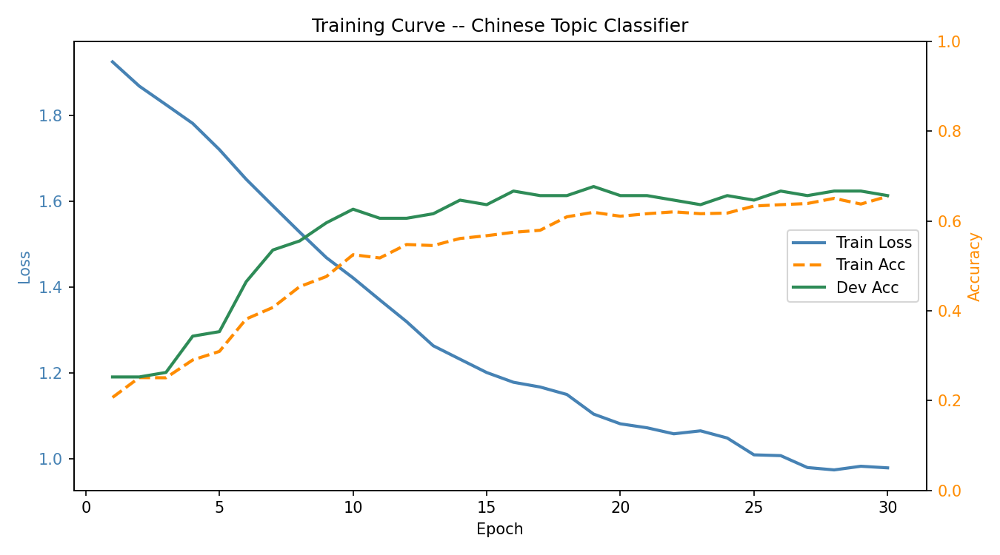

# Neural-topic-classification-for-Simplified-Chinese

This is my assignment 3 for the Machine learning for statistical NLP course. The goal was to build a pipeline that takes Chinese sentences from the SIB-200 Wikipedia dataset, turns them into numerical vectors using FastText, and then trains a small neural network to classify each sentence into one of 7 topic categories like travel, sports, politics, etc.

Everything was written in Python and tested on the mltgpu server.

---

## The Dataset

The dataset is the SIB-200 dataset for Simplified Chinese (zho_Hans). It's stored in the `Database/` folder and has three files:

- `train.tsv` — training sentences with their topic labels
- `dev.tsv` — development/validation sentences
- `test.tsv` — test sentences (used only for final evaluation)
- `labels.txt` — the 7 topic categories

Each TSV file has two columns: `text` (the Chinese sentence) and `category` (the topic label).

The 7 categories are: science & technology, travel, sports, health, entertainment, politics, food & drink.

---

## Project Structure
```
Neural-topic-classification-for-Simplified-Chinese/
├── codes/
│   ├── training.py        # Part 2 - trains FastText embeddings
│   ├── snt_emb.py         # Part 2 - converts sentences to vectors
│   ├── clf_training.py    # Part 3 - trains the PyTorch classifier
│   └── evaluation.py      # Part 4 - evaluates the model
├── Database/
│   ├── train.tsv
│   ├── dev.tsv
│   ├── test.tsv
│   └── labels.txt
├── training_curve.png     # Bonus - plot of training progress
├── session_transcript.txt         # Part 5 - terminal session on mltgpu
└── README.md
```

---

## Part 1 — GitHub

The repository is public on GitHub at (Obviously :v ):
**https://github.com/Aveiro11/Neural-topic-classification-for-Simplified-Chinese**

---

## Part 2 — Sentence Embeddings

This part has two scripts.

### What I did

Since Chinese doesn't use spaces between words, I couldn't just split sentences by whitespace like you would in English. Instead I treated every single Chinese character as its own "word". So the sentence "北京是一个城市" becomes the tokens ["北", "京", "是", "一", "个", "城", "市"].

For Latin characters and numbers mixed into the text (like "GPS" or "2023"), I kept them together as one token and lowercased them, so "GPS" and "gps" both map to the same thing. Punctuation and spaces are just ignored.

### Script 1 — `codes/training.py`

This trains a FastText model on all three TSV files (train, dev and test combined). We use all three so that the embeddings cover every character that appears anywhere in the dataset. This is fine because we're only training unsupervised embeddings here — we're not touching the labels.
```bash
python codes/training.py Database/train.tsv Database/dev.tsv Database/test.tsv --dim 100 --output embeddings.model --epochs 10
```

Arguments:
- `tsv_files` — one or more TSV files to train on
- `--dim` — size of each embedding vector (default: 100)
- `--output` — where to save the trained model (default: embeddings.model)
- `--epochs` — training passes over the data (default: 10)
- `--window` — context window size (default: 5)
- `--min_count` — ignore tokens appearing fewer than this many times (default: 1)
- `--workers` — CPU threads to use (default: 4)

### Script 2 — `codes/snt_emb.py`

This loads the FastText model and converts each sentence into one vector by averaging all its character vectors together. It does this for train, dev and test separately and saves each as a `.npz` file.
```bash
mkdir -p sentence_embeddings

python codes/snt_emb.py Database/train.tsv Database/dev.tsv Database/test.tsv --model embeddings.model --output_dir sentence_embeddings/
```

Arguments:
- `tsv_files` — TSV files to convert
- `--model` — path to the FastText model from the previous step
- `--output_dir` — folder to save the .npz files (default: sentence_embeddings/)

Output files:
- `sentence_embeddings/train_embeddings.npz` — 701 sentences
- `sentence_embeddings/dev_embeddings.npz` — 99 sentences
- `sentence_embeddings/test_embeddings.npz` — 204 sentences

---

## Part 3 — Neural Topic Classification

### Script — `codes/clf_training.py`

This trains a feed-forward neural network in PyTorch to classify sentence embeddings into one of the 7 topic categories.

### The model architecture
```
Input (100-dim sentence embedding)
        ↓
Linear (100 → 256)
        ↓
ReLU
        ↓
Dropout (0.3)
        ↓
Linear (256 → 128)
        ↓
ReLU
        ↓
Dropout (0.3)
        ↓
Linear (128 → 7)
        ↓
Output (7 scores, one per category)
```

We use CrossEntropyLoss as the loss function (standard for multi-class classification) and Adam as the optimizer.
```bash
python codes/clf_training.py --train sentence_embeddings/train_embeddings.npz --dev sentence_embeddings/dev_embeddings.npz --labels Database/labels.txt --output model.pt --epochs 30 --batch_size 64 --plot training_curve.png
```

Arguments:
- `--train` — path to train_embeddings.npz
- `--dev` — path to dev_embeddings.npz (optional, used for validation tracking)
- `--labels` — path to labels.txt
- `--output` — where to save the trained model (default: model.pt)
- `--epochs` — number of training epochs (default: 20)
- `--batch_size` — batch size (default: 64)
- `--hidden` — hidden layer sizes (default: 256 128)
- `--lr` — learning rate (default: 0.001)
- `--dropout` — dropout probability (default: 0.3)
- `--plot` — save a training curve PNG here (optional, for the bonus)
- `--seed` — random seed for reproducibility (default: 42)

---

## Part 4 — Evaluation

### Script — `codes/evaluation.py`

This loads the saved model and runs it on the test set. It prints the overall accuracy, per-class accuracy, a confusion matrix, and the most common mistakes.
```bash
python codes/evaluation.py --model model.pt --test sentence_embeddings/test_embeddings.npz
```

Arguments:
- `--model` — path to the saved model (.pt file)
- `--test` — path to test_embeddings.npz

### Results
```
=======================================================
  Test samples : 204
  Accuracy     : 0.6225  (127/204 correct)
  Chance level : 0.1429  (random guessing over 7 classes)
  Above chance : YES  (difference: +0.4797)
=======================================================

Per-class accuracy:
  Category                        Correct / Total   Acc
  -------------------------------------------------------
  science/technology               39 /  51         0.765
  travel                           34 /  40         0.850
  politics                         20 /  30         0.667
  sports                           14 /  25         0.560
  health                           10 /  22         0.455
  entertainment                     1 /  19         0.053
  geography                         9 /  17         0.529

Confusion Matrix  (rows = true label, columns = predicted label):

                    science/technology    travel    politics    sports    health    entertainment    geography
-------------------------------------------------------------------------------------------------------------
science/technology                  39         5           0         1         5                0            1
travel                               3        34           1         0         0                2            0
politics                             1         4          20         1         3                0            1
sports                               1         4           0        14         3                2            1
health                              10         0           2         0        10                0            0
entertainment                        8         6           3         1         0                1            0
geography                            3         2           1         1         0                1            9
```

### Confusion Matrix Observations

Looking at the results a few things stand out:

- **entertainment** was by far the hardest category — the model only got 1 out of 19 correct (5.3%). It mostly got misclassified as science/technology or travel, which suggests the embeddings for entertainment sentences don't form a very distinct cluster.
- **travel** was the easiest category with 85% accuracy. Travel sentences probably use very specific vocabulary around places and tourism that makes them easy to distinguish.
- **health** got confused with **science/technology** 10 times, which makes sense since health articles on Wikipedia often use scientific and technical language.
- **entertainment** got confused with both **science/technology** (8 times) and **travel** (6 times), suggesting the model struggles to find anything distinctive about entertainment sentences at the character-embedding level.
- The diagonal of the confusion matrix is the highest value in most rows, meaning the model is getting more things right than wrong for most categories.

### Is the model better than chance?

With 7 categories, a model randomly guessing would get about **14.3%** accuracy. Our model achieved **62.25%** on the test set, which is more than 4 times better than chance (a difference of +0.4797). This shows the model has genuinely learned real patterns in the data. That said, the entertainment category is clearly a weak point and bringing that up would likely improve the overall accuracy further.

---

## Bonus — Validation Tracking

The training script supports validation tracking through the `--dev` and `--plot` arguments. When `--dev` is provided, it evaluates accuracy on the dev set after every epoch and prints it alongside the training accuracy. When `--plot` is provided, it saves a PNG showing how the loss and accuracy changed over training.

The `training_curve.png` file in this repo is from the run with 30 epochs. By epoch 30, the model reached a training accuracy of 0.6549 and a dev accuracy of 0.6566.


---

## Part 5 — How to Run Everything

Make sure you are in the root of the project folder, then run the steps in this order:

**Step 1 — Install dependencies**
```bash
pip install pandas numpy gensim torch matplotlib
```

**Step 2 — Train FastText embeddings**
```bash
python codes/training.py Database/train.tsv Database/dev.tsv Database/test.tsv --dim 100 --output embeddings.model --epochs 10
```

**Step 3 — Make sentence embeddings**
```bash
mkdir -p sentence_embeddings
python codes/snt_emb.py Database/train.tsv Database/dev.tsv Database/test.tsv --model embeddings.model --output_dir sentence_embeddings/
```

**Step 4 — Train the classifier**
```bash
python codes/clf_training.py --train sentence_embeddings/train_embeddings.npz --dev sentence_embeddings/dev_embeddings.npz --labels Database/labels.txt --output model.pt --epochs 30 --batch_size 64 --plot training_curve.png
```

**Step 5 — Evaluate**
```bash
python codes/evaluation.py --model model.pt --test sentence_embeddings/test_embeddings.npz
```

---

## Session Transcript

See `transcript.txt` and `session_transcript.txt` in this repo for the full raw terminal session recorded on mltgpu on 2026-03-31.
For a more polished readable version go for `Transcript.md`